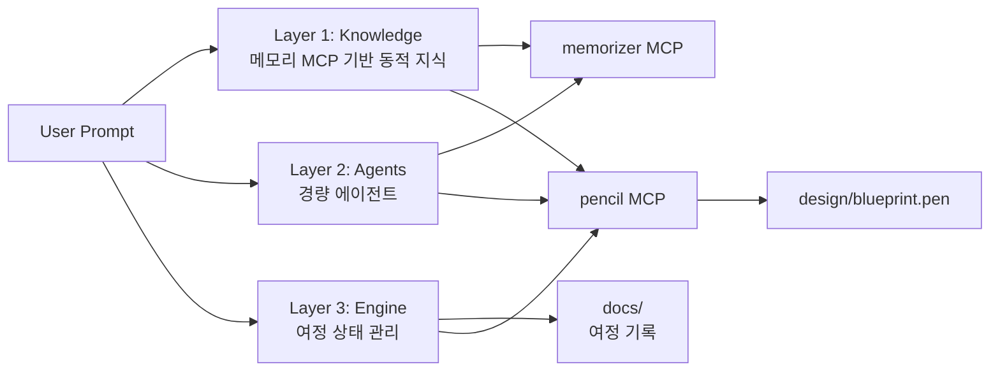
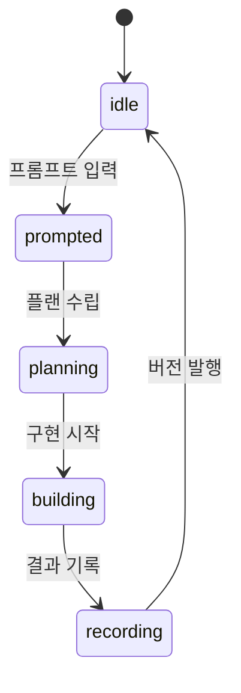
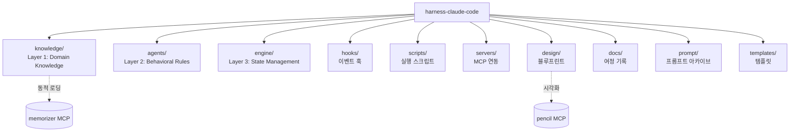
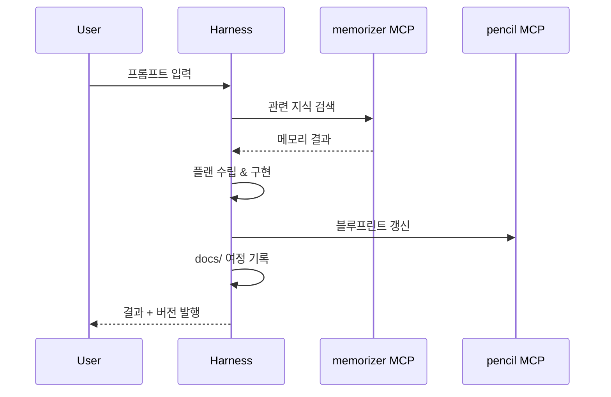

# harness-claude-code 아키텍처

## 전체 구조

## 여정(Journey) 상태 모델

bkit의 PDCA State Machine(20 transitions, 9 guards) 대신,
단순한 선형 여정 모델로 시작합니다.

| 상태 | 설명 | 산출물 |
|------|------|--------|
| idle | 대기 | - |
| prompted | 프롬프트 입력됨 | `prompt/*.md` |
| planning | 설계 진행 중 | 플랜 파일 |
| building | 구현 진행 중 | 소스 코드, 설정 |
| recording | 여정 기록 중 | `docs/vX.Y.Z.md`, `design/` 갱신 |

## 디렉토리-계층 매핑

## bkit 대비 차별화

| 관점 | bkit | harness |
|------|------|---------|
| 지식 소스 | 정적 SKILL.md 36개 | 메모리 MCP 동적 검색 |
| 상태 모델 | PDCA (20 transitions, 9 guards) | Journey (4 states, 선형) |
| 시각화 | CLI 대시보드 (텍스트 기반) | Pencil MCP 블루프린트 (.pen) |
| 에이전트 | 31개 (opus 10 / sonnet 19 / haiku 2) | 최소 출발, 점진 성장 |
| 훅 시스템 | 6-Layer (18 이벤트) | Layer 1 (hooks.json) 중심 |
| 개발 기록 | PDCA docs + archive | 프롬프트 여정 중심 기록 |
| 설치 | 플러그인 마켓플레이스 | 독립 프로젝트 |

## 데이터 흐름

