# harness-claude-code 아키텍처

## 전체 구조

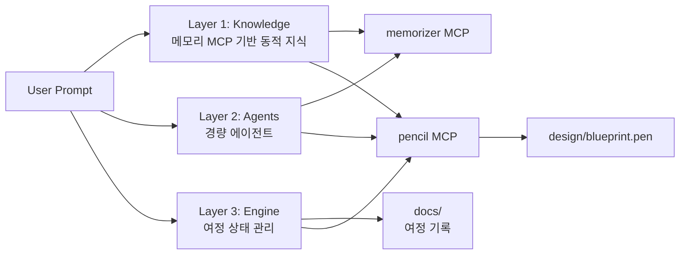

## 여정(Journey) 상태 모델

bkit의 PDCA State Machine(20 transitions, 9 guards) 대신,
단순한 선형 여정 모델로 시작합니다.

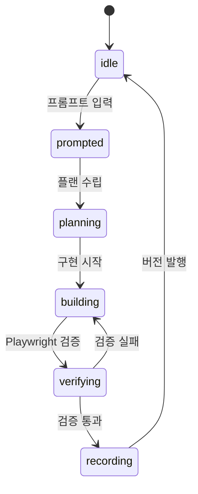

| 상태 | 설명 | 산출물 |
|------|------|--------|
| idle | 대기 | - |
| prompted | 프롬프트 입력됨 | `prompt/*.md` |
| planning | 설계 진행 중 | 플랜 파일 |
| building | 구현 진행 중 | 소스 코드, 설정 |
| verifying | Playwright 브라우저 검증 | `tc/screenshot-*.png`, 체크리스트 |
| recording | 여정 기록 중 | `docs/vX.Y.Z.md`, `design/` 갱신 |

## 디렉토리-계층 매핑

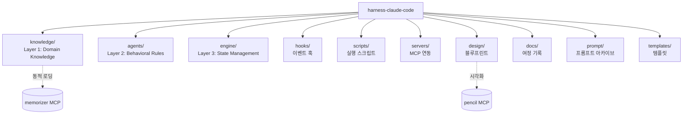

## bkit 대비 차별화

| 관점 | bkit | harness |
|------|------|---------|
| 지식 소스 | 정적 SKILL.md 36개 | 메모리 MCP 동적 검색 |
| 상태 모델 | PDCA (20 transitions, 9 guards) | Journey (4 states, 선형) |
| 시각화 | CLI 대시보드 (텍스트 기반) | Pencil MCP 블루프린트 (.pen) |
| 에이전트 | 31개 (opus 10 / sonnet 19 / haiku 2) | 최소 출발, 점진 성장 |
| 훅 시스템 | 6-Layer (18 이벤트) | Layer 1 (hooks.json) 중심 |
| 개발 기록 | PDCA docs + archive | 프롬프트 여정 중심 기록 |
| 설치 | 플러그인 마켓플레이스 | 독립 프로젝트 |

## 데이터 흐름

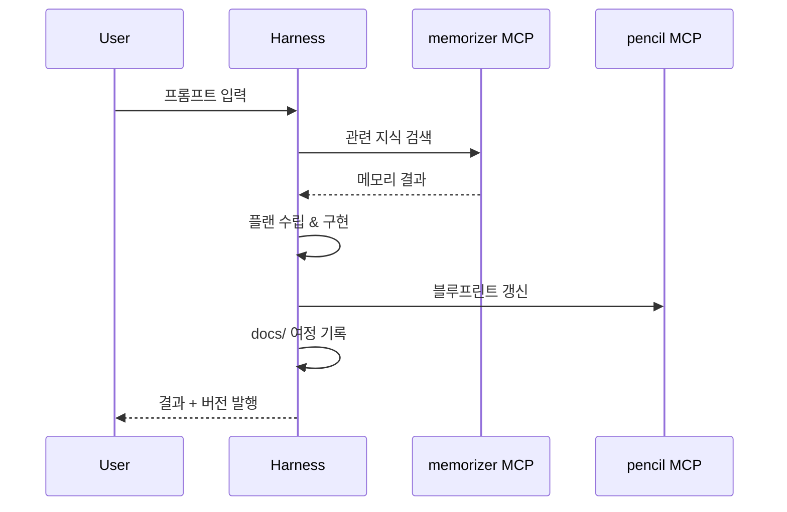

---

## Agentic Loop ↔ Journey 통합 모델 (v0.0.3 추가)

> 출처: memorizer `aa36789f` (악분 - Claude Code 동작 원리 Part 1)

### Agentic Loop

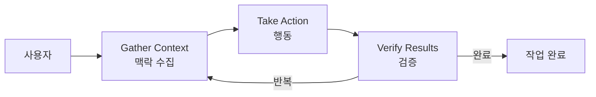

### Journey ↔ Agentic Loop 매핑

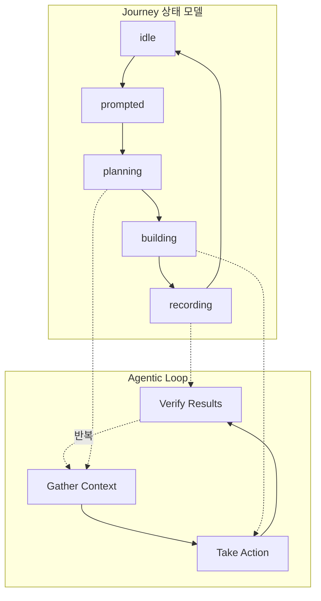

### 하네스 6대 구성요소 → 디렉토리 매핑

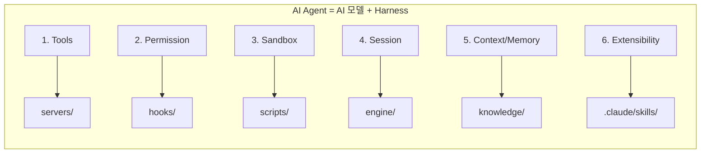

### 에이전트 3종과 Agentic Loop

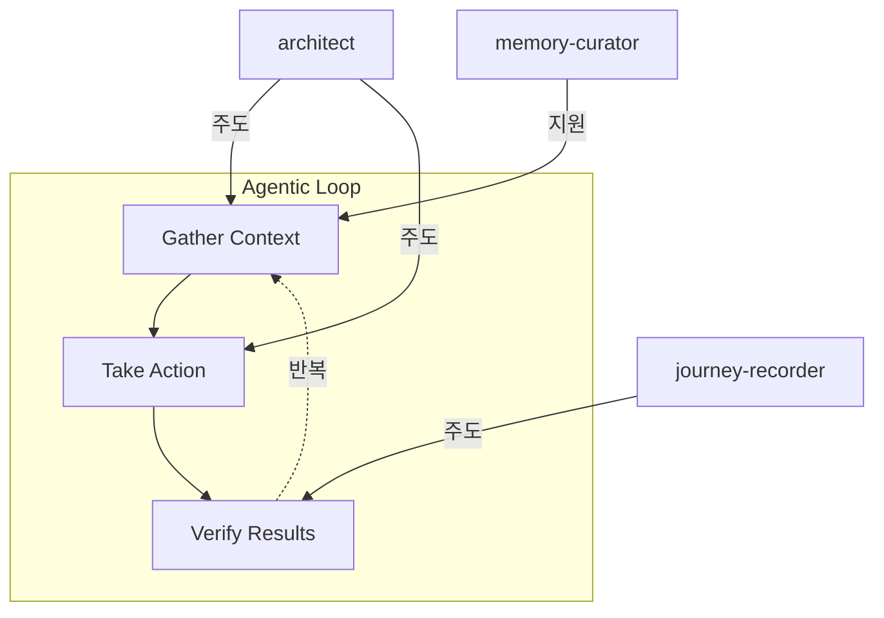

### 오케스트레이터 패턴

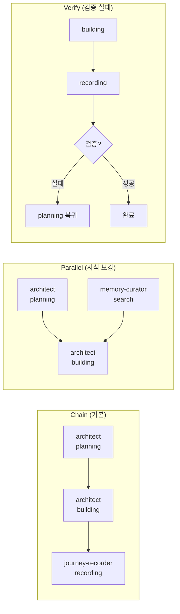

---

## revfactory 하네스: Agent Team & Skill Architect (v0.0.2 추가)

> 출처: [revfactory](https://github.com/revfactory) — 도메인 분석 기반 하네스 설계

### 6-Phase 워크플로우

도메인 분석에서 출발하여 검증/배포까지 이르는 6단계 구조가 핵심입니다.

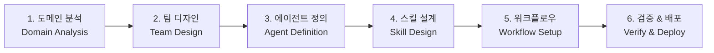

| Phase | 설명 | harness 대응 |
|-------|------|-------------|
| 1. 도메인 분석 | 문제 영역을 먼저 분석 | `knowledge/` 메모리 기반 도메인 탐색 |
| 2. 팀 디자인 | 에이전트 팀 구성 설계 | `agents/` 팀 구조 정의 |
| 3. 에이전트 정의 | 개별 에이전트 역할/능력 | `agents/` 에이전트 스펙 |
| 4. 스킬 설계 | 에이전트별 스킬 부여 | `knowledge/` 스킬 매핑 |
| 5. 워크플로우 | 실행 흐름 구성 | `engine/` 워크플로우 정의 |
| 6. 검증 & 배포 | 결과 검증 및 배포 | `engine/` 검증 게이트 |

### Core Components

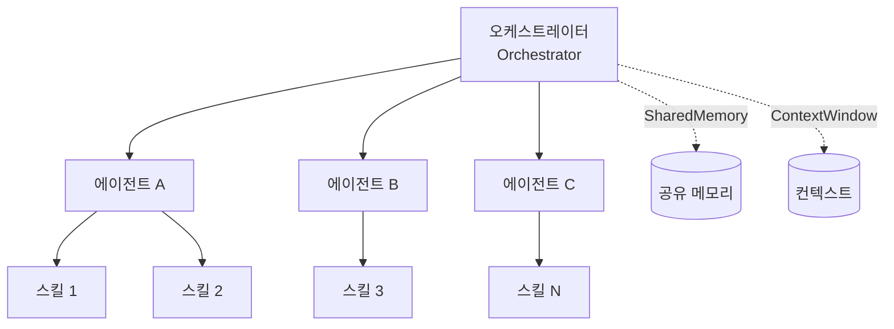

### Two Execution Modes

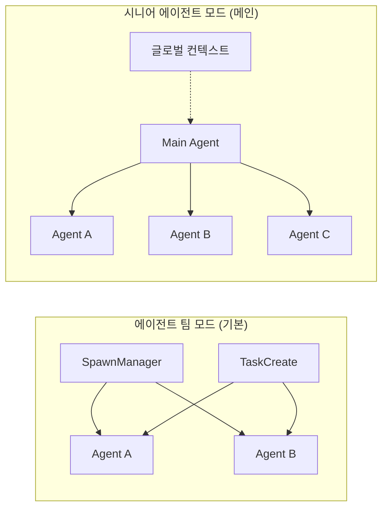

| 모드 | 특징 | 통신 방식 |
|------|------|-----------|
| 에이전트 팀 | SpawnManager가 Agent 생성, TaskCreate로 작업 배분 | TaskCreate/Update |
| 시니어 에이전트 | 메인 Agent가 전체 조율, 글로벌 컨텍스트 공유 | SendMessage (실시간) |

### Architecture Patterns & Data Protocols

**패턴**: Chain · Verify · Parallel · Workflow

**프로토콜**:
| 프로토콜 | 용도 |
|----------|------|
| SendMessage | 실시간 에이전트 간 통신 |
| TaskCreate/Update | 작업 추적 |
| 파일 기록 | Workspace/Artifacts 영속화 |

---

## 프로젝트 생성 워크플로우 (v0.0.4 추가)

> 출처: projects/sample1 생성 여정 (2026-03-23)

### PRD → 프로젝트 생성 파이프라인

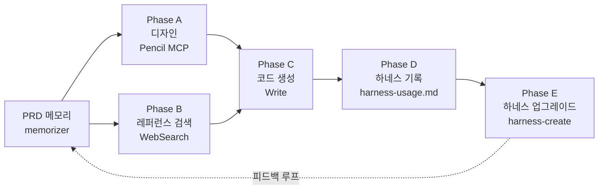

### 프로젝트 생성 시 3계층 활용

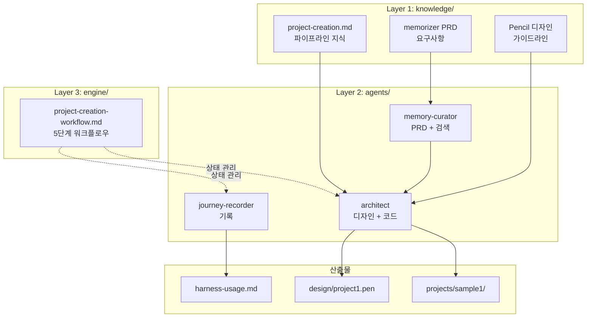

### 디렉토리 구조 (projects/ 추가)

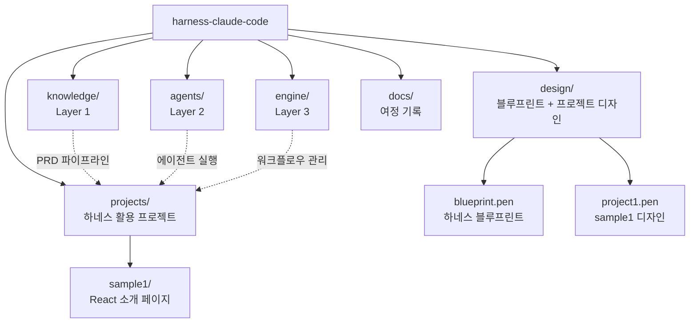

---

## Playwright 검증 워크플로우 (v0.0.5 추가)

> 출처: projects/sample1 Playwright CLI 검증 여정 (2026-03-23)

### 검증 흐름

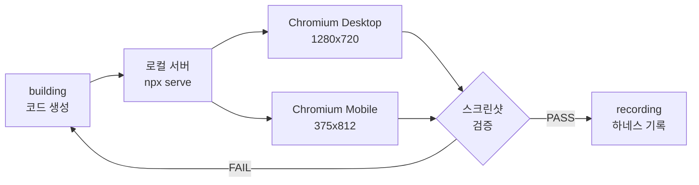

### Journey 상태 전이 (verifying 추가)

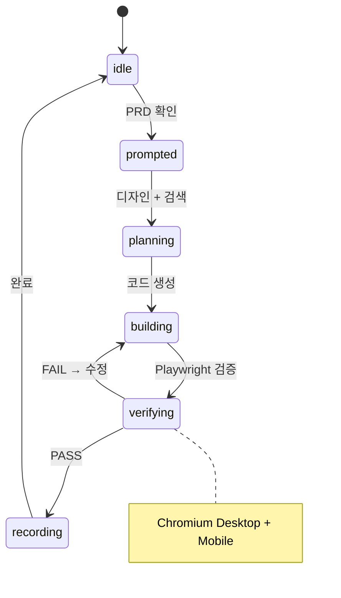
