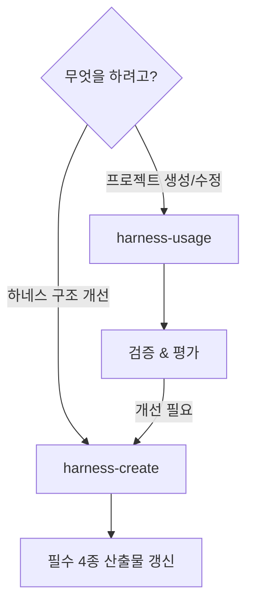

# 하네스 스킬 활용 가이드 — 베스트 프랙티스

> 하네스의 스킬을 이용해 프로젝트와 하네스 부분요소를 효과적으로 만드는 방법을 안내합니다.

## 스킬 선택 가이드

| 목적 | 스킬 | 트리거 예시 |
|------|------|-----------|
| 프로젝트 생성/수정 | `harness-usage` | "하네스를 이용해 프로젝트를 생성하려 합니다" |
| 하네스 자체 개선 | `harness-create` | "하네스를 추가 개선하고자 합니다" |



---

## 프로젝트 생성 베스트 프랙티스

### 1. PRD를 memorizer에 먼저 저장

프로젝트 생성 전, 요구사항을 memorizer MCP에 저장합니다.

```
memorizer에 저장할 PRD 예시:
- 프로젝트 유형 (웹, 모바일, 랜딩 페이지 등)
- 기술 스택 조건 (React, Vue, 서버 유무 등)
- 디자인 방향 (모던, 미니멀, 다크 등)
- 참고할 사이트나 스타일
```

**왜?** — memorizer에 PRD를 저장하면 `harness-usage` 스킬이 자동으로 조회하여 일관된 프로젝트를 생성합니다.

### 2. Pencil 디자인 → 코드 순서

코드를 먼저 작성하지 말고, Pencil MCP로 디자인을 먼저 합니다.

```
순서:
1. get_guidelines(topic) — 프로젝트 유형별 가이드라인
2. get_style_guide(tags) — 스타일 방향 설정
3. batch_design — 섹션별 디자인
4. get_screenshot — 시각적 검증
5. 코드 생성 — 디자인의 색상/타이포/레이아웃을 코드에 반영
```

**왜?** — 디자인 파일이 코드의 "진실의 원천"이 되어 시각적 일관성을 보장합니다.

### 3. 검증 체크리스트 반드시 실행

프로젝트 생성/수정 후 `tc/checklist-vX.Y.Z.md`를 반드시 작성합니다.

```
4대 검증 항목:
1. 브라우저 렌더링 — HTML 구조, CDN 경로
2. 디자인-코드 일관성 — 색상, 타이포, 레이아웃 대조
3. harness-usage.md — 3계층 활용 기록 완성도
4. 하네스 업그레이드 — 필수 4종 갱신 필요성
```

**왜?** — 체크리스트가 축적되면 프로젝트의 품질 이력이 됩니다.

---

## 하네스 평가 활용법

### 평가 점수로 하네스 성숙도 추적

매 프로젝트 생성/수정 시 5개 축(각 20점, 총 100점)으로 평가합니다.

| 평가 축 | 의미 |
|---------|------|
| knowledge/ 활용도 | 메모리와 가이드라인을 얼마나 활용했는가 |
| agents/ 역할 분리 | 에이전트 역할이 명확히 구분되었는가 |
| engine/ 워크플로우 | Journey 상태 전이를 준수했는가 |
| Agentic Loop | Gather→Action→Verify 순환을 적용했는가 |
| 개선 피드백 | 구체적이고 실행 가능한 제안을 했는가 |

### 저점수 축 개선 방법

| 저점수 축 | 개선 방법 |
|----------|----------|
| knowledge/ | memorizer에 더 많은 도메인 지식 축적, 가이드라인 참조 습관화 |
| agents/ | 작업 시 에이전트 역할을 의식적으로 구분 |
| engine/ | project-creation-workflow.md 숙지, Phase 순서 준수 |
| Agentic Loop | 각 단계에서 "지금 Gather? Action? Verify?" 자문 |
| 피드백 | "잘 됐다" 대신 "X가 잘 됐는데, Y 때문이었다. Z를 더 하면 좋겠다" 형식 |

---

## 스킬 조합 패턴

### 패턴 1: 프로젝트 생성 → 하네스 개선

```
1. /harness-usage — 프로젝트 생성
2. 검증 & 평가 수행
3. 개선 관찰사항 확인
4. /harness-create — 하네스 업그레이드 (관찰사항 반영)
```

**사례**: sample1 프로젝트 생성 → engine/에 프로젝트 생성 워크플로우 부재 발견 → harness-create로 `project-creation-workflow.md` 추가 (v0.0.4)

### 패턴 2: 반복 프로젝트 생성으로 하네스 성숙

```
프로젝트 1: 평가 60점 → knowledge/ 부족 발견
   ↓ harness-create로 knowledge/ 보강
프로젝트 2: 평가 75점 → engine/ 워크플로우 미흡
   ↓ harness-create로 engine/ 보강
프로젝트 3: 평가 90점 → 하네스 안정기
```

**핵심**: 프로젝트를 만들 때마다 하네스가 함께 성장합니다.

### 패턴 3: 프로젝트 수정 시

```
1. /harness-usage — 수정 워크플로우 (B) 선택
2. 현재 상태 파악 → 수정 → 검증
3. 새 체크리스트 작성 (기존 체크리스트와 비교 가능)
```

---

## 실전 팁

1. **PRD는 간결하게** — memorizer에 저장할 때 핵심 조건 3~5줄이면 충분
2. **디자인 시간을 아끼지 말 것** — Pencil 디자인 품질이 코드 품질을 결정
3. **평가를 습관화** — 점수가 아니라 "어디가 부족한가?"에 집중
4. **harness-usage.md의 "개선 관찰사항"이 가장 중요** — 이것이 하네스 진화의 연료
5. **두 스킬을 번갈아 사용** — 프로젝트 생성(harness-usage) → 하네스 개선(harness-create) 순환
