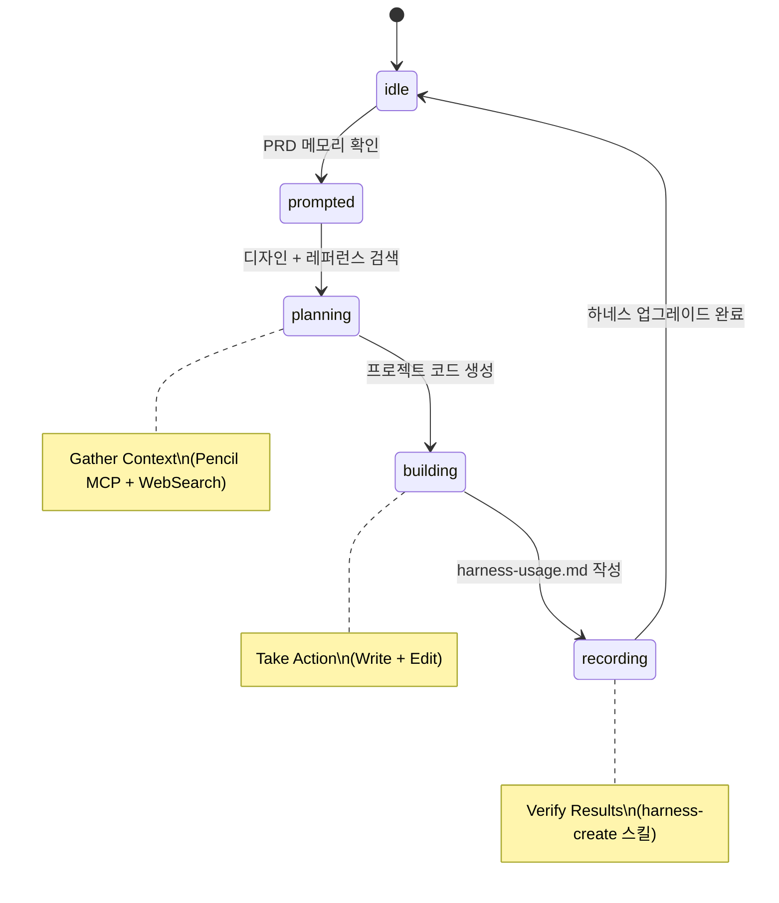

# 프로젝트 생성 워크플로우

> 출처: projects/sample1 생성 여정 (2026-03-23)

## 개요

하네스를 활용하여 새 프로젝트를 생성하는 워크플로우.
PRD 메모리 → 디자인 → 코드 → 기록 → 업그레이드의 순환 구조를 따른다.

## Journey 상태 전이



## 단계별 상세

### Phase A: 디자인 (planning)
- **트리거**: PRD 메모리 ID 확인
- **에이전트**: architect (주도), memory-curator (지원)
- **MCP**: pencil (get_guidelines → get_style_guide → batch_design → get_screenshot)
- **산출물**: .pen 디자인 파일

### Phase B: 레퍼런스 검색 (planning, 병렬)
- **트리거**: Phase A와 동시 시작
- **에이전트**: memory-curator
- **도구**: WebSearch, memorizer.search
- **산출물**: 레퍼런스 정보 (memorizer에 저장)

### Phase C: 프로젝트 생성 (building)
- **트리거**: Phase A+B 완료
- **에이전트**: architect
- **도구**: Write, Edit
- **산출물**: projects/[프로젝트명]/ 하위 파일들
- **원칙**: 디자인 파일의 색상/타이포/레이아웃을 충실히 코드에 반영

### Phase D: 하네스 사용 기록 (recording)
- **트리거**: Phase C 완료
- **에이전트**: journey-recorder
- **도구**: Write
- **산출물**: projects/[프로젝트명]/harness-usage.md

### Phase E: 하네스 업그레이드 (새 여정 순환)
- **트리거**: Phase D 완료 + 개선 관찰사항 존재
- **에이전트**: architect + journey-recorder
- **도구**: harness-create 스킬
- **산출물**: 필수 4종 (docs/vX.Y.Z.md, README.md, blueprint.pen, architecture.md)

## 오케스트레이터 패턴

```
Phase A + Phase B (Parallel)
     ↓
Phase C (Chain)
     ↓
Phase D (Chain)
     ↓
Phase E (Chain → 새 여정 순환)
```

## 검증 체크리스트

- [ ] 프로젝트가 브라우저에서 정상 렌더링되는가?
- [ ] 디자인 파일과 코드의 시각적 일관성이 있는가?
- [ ] harness-usage.md에 3계층 활용 내역이 기록되었는가?
- [ ] 하네스 업그레이드 필수 4종이 갱신되었는가?
